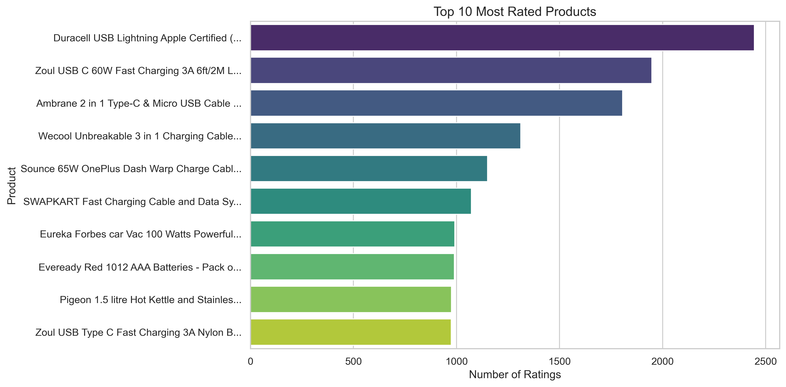
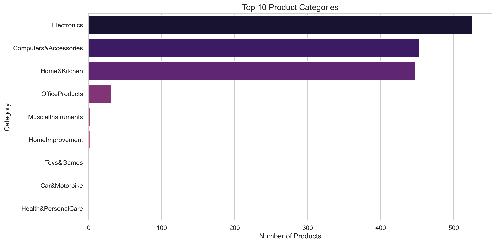
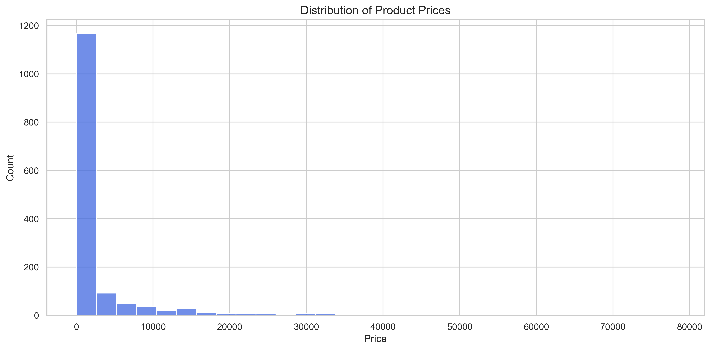
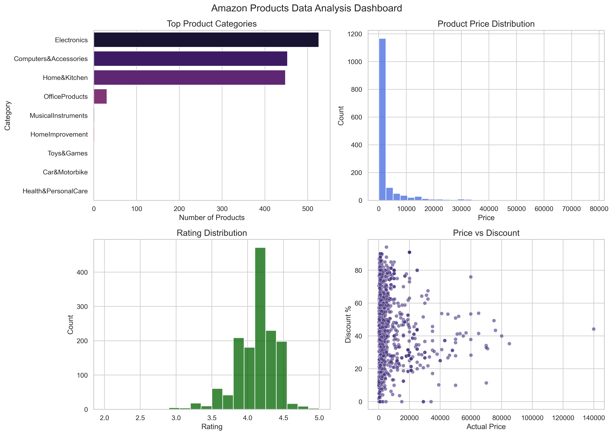

# Analisi Dati Prodotti Amazon

Questo progetto analizza un dataset di prodotti Amazon per identificare trend relativi a prezzi, sconti, rating e categorie.

L’obiettivo è applicare tecniche di data analysis utilizzando Python e creare visualizzazioni utili per comprendere il comportamento dei prodotti.

---

## Dataset

Il dataset contiene informazioni su prodotti Amazon, tra cui:

- Nome prodotto
- Categoria
- Prezzo originale
- Prezzo scontato
- Rating
- Numero di recensioni

---

## Tecnologie utilizzate

- Python
- Pandas
- Matplotlib
- Seaborn
- Jupyter Notebook

---

## Analisi effettuate

Nel progetto sono state sviluppate diverse analisi:

- Analisi dei prodotti più recensiti
- Distribuzione dei prezzi
- Distribuzione dei rating
- Analisi degli sconti
- Analisi delle categorie
- Correlazione tra prezzo, rating e sconti

---

## Visualizzazioni

### Prodotti più recensiti



### Distribuzione categorie



### Distribuzione prezzi



### Dashboard finale



---

## Insight principali

- Alcuni prodotti dominano il numero totale di recensioni, indicando alta popolarità.
- La maggior parte dei prodotti ha rating compresi tra 4 e 5.
- I prodotti con prezzo più alto tendono ad avere sconti maggiori.
- Alcune categorie dominano il catalogo Amazon.

---

## Struttura del progetto
# Analisi Dati Prodotti Amazon

Questo progetto analizza un dataset di prodotti Amazon per identificare trend relativi a prezzi, sconti, rating e categorie.

L’obiettivo è applicare tecniche di data analysis utilizzando Python e creare visualizzazioni utili per comprendere il comportamento dei prodotti.

---

## Dataset

Il dataset contiene informazioni su prodotti Amazon, tra cui:

- Nome prodotto
- Categoria
- Prezzo originale
- Prezzo scontato
- Rating
- Numero di recensioni

---

## Tecnologie utilizzate

- Python
- Pandas
- Matplotlib
- Seaborn
- Jupyter Notebook

---

## Analisi effettuate

Nel progetto sono state sviluppate diverse analisi:

- Analisi dei prodotti più recensiti
- Distribuzione dei prezzi
- Distribuzione dei rating
- Analisi degli sconti
- Analisi delle categorie
- Correlazione tra prezzo, rating e sconti

---

## Visualizzazioni

### Prodotti più recensiti


### Distribuzione categorie


### Distribuzione prezzi


### Dashboard finale


---

## Insight principali

- Alcuni prodotti dominano il numero totale di recensioni, indicando alta popolarità.
- La maggior parte dei prodotti ha rating compresi tra 4 e 5.
- I prodotti con prezzo più alto tendono ad avere sconti maggiori.
- Alcune categorie dominano il catalogo Amazon.

---

## Struttura del progetto

```
ecommerce-sales-data-analysis
│
├── data  
│   └── amazon.csv  
│
├── notebooks  
│   └── amazon_analysis.ipynb  
│
├── images  
│   ├── top_products.png  
│   ├── category_analysis.png  
│   ├── price_distribution.png  
│   └── dashboard.png  
│
└── README.md  
```
---

## Autore

Alessandro Ronco